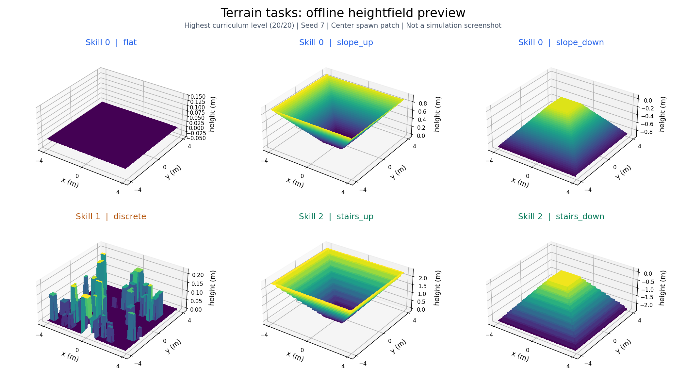

# 三类地形行走任务适配

日期：2026-09-15。默认后端为 Isaac Lab，备用 Gym 后端同步使用以下任务。

## 当前分组

| ID / 技能名 | 实际地形 | 用户希望学到的行为 |
|---|---|---|
| 0 / `flat_slope` | 平地、上坡、下坡 | 轮式运动为主，不需要主动抬腿 |
| 1 / `discrete` | 随机离散障碍 | 根据局部障碍不规则抬腿 |
| 2 / `stairs` | 上楼梯、下楼梯 | 随踏步较有规律地抬腿 |

本轮完成地形、任务分配、重置、终止、课程、日志和技能接口适配。
表中的运动方式是学习目标；没有锁死腿关节，也没有加入抬腿或步态奖励。
随后已适配共用奖励：复杂地形放宽四项姿态权重、停车关节容忍量及局部高度参考；S2 的两项速度跟踪保持原样。见[奖励说明](REWARDS_ZH.md)。

## 数据链

```text
mujica/skills.py：固定技能名称、ID、地形分组、协议版本
  → mujica/terrain.py：生成六种地形，均衡分配三类任务
  → Lab env.py / Gym mujica_robot.py：创建场景与 task_ids
  → mujica/locomotion_tasks.py：命令、驱动、终止、课程、诊断
  → mujica/rewards.py：共用奖励，task_ids 决定姿态参数
  → S1：task_ids 决定技能输入，训练共享 actor + estimator
  → S2：冻结底层，由 selector 选择 skill_ids
  → runner / checkpoint / export / play / sim2sim：使用同一技能协议
```

S2 的 `task_ids` 表示实际地形，`skill_ids` 表示选择器当前选择，二者分开记录。
切换技能不改变物理地形、命令、重置条件、回合时钟或 GRU 状态。
actor 的历史仍为 6×58=348 维，critic 270 维，动作 16 维；网络结构未改。

## 地形与样本分配

下图由实际高度场数组离线绘制，展示最高难度下的六种地形；各图高度轴范围不同，未运行物理仿真。



每块地形 8×8m，中央 2×2m 平整区域用于出生，中心高度为 0。
默认 20 行难度、18 列地形。列按下面顺序重复三组：

```text
flat, slope_up, slope_down, discrete, stairs_up, stairs_down
 0        0          0         1          2           2
```

环境数量按三类任务均分，余数依次分给 ID 0、1；每类内部再轮流分配到所属地形列。
因此地形种类较多的任务不会自动获得更多环境。64 环境的实际分配为：

| 任务 | 环境数 | 地形明细 |
|---|---:|---|
| `flat_slope` | 22 | 平地 8、上坡 7、下坡 7 |
| `discrete` | 21 | 离散障碍 21 |
| `stairs` | 21 | 上楼 11、下楼 10 |

至少 9 个环境可覆盖六种地形。`--terrain plane` 仅用于平地接口检查，所有环境都标记为 `flat_slope`。
CLI 的 `--skill` 只改变播放时的策略输入，不筛选或重建物理地形。

### 几何参数

| 类型 | 当前生成方式 |
|---|---|
| 平地 | 高度恒为 0 |
| 坡道 | 出生区外向四周连续上升或下降；坡度为高度变化/水平距离 |
| 离散障碍 | 每块随机放置 40 个矩形；位置、长宽、高度独立随机，中央出生区清空 |
| 楼梯 | 出生区外向四周逐级上升或下降；同一块内踏步宽度、级高固定 |

坡道和楼梯采用方形同心轮廓。从中央沿前后左右向外走，上行地形均变高，下行地形均变低；
转向回到中央时方向相反。这使三维速度命令中的前后、侧向运动都能接触相应地形。

20 级课程的难度系数为 `(level + 1) / 20`，级数从 0 开始：

- 坡度：配置 `[0, 0.3]`，最低级实际 0.015，最高级 0.3。
- 楼梯：踏步宽 0.3m，级高最低级 0.059m、最高级 0.23m。
- 离散障碍：长宽各从 `[0.25, 0.75]m` 采样；高度从 0.05m 到当前难度上限采样，最高级上限 0.22m。
- 水平/垂直分辨率为 0.1m/0.005m，上述尺寸和高度最终量化到高度场网格；障碍可能重叠，出生区清空后实际可见数量可能少于 40。

减小 `--terrain-rows` 只保留较低难度，2 行启动检查不会被拉伸成最高难度。
地形列数必须为 6 的正整数倍。参数在 `mujica/isaaclab/defaults.json` 与 Gym 的 `mujica_config.py` 中同步保存。

## 重置、终止和课程

- S1/S2 全部使用默认正立朝向，保留原来的小幅出生位置、初速度和关节位置扰动。
- 三类任务都采样前后、侧向、偏航速度命令；取消旧任务的零命令/偏航限制。
- 所有关节从第一物理步开始按原混合 PD 与电机包络驱动。
- 回合最长 20 秒。配置的终止刚体（默认机身）接触力超过 1N 判为失败。
- 距离地形块边界不足 0.5m 时提前截断，防止下一块地形混入当前任务标签。该截断使用真实终态价值补偿。
- 同一步碰撞且超时/越界时，以失败终止为准，不做超时价值补偿。
- 默认从最低难度开始。升级须跟踪分数连续达标至少 3 秒、累计命令距离超过 0.5m、实际净位移至少 1.5m，且没有失败。
- 失败或实际位移不足累计命令距离的 50% 时降级；同回合已满足升级条件时优先升级。
- 升降级只改变同一地形列的难度，保留任务类别。纯平地维持等级 0。

这些阈值是当前工程课程设置，未新增奖励项。旧恢复被动期、6 秒回合、随机翻倒、恢复站稳指标，以及高台/出坑逻辑均已移除。

## 日志

`environment.json` 和检查点元数据包含：

- `task_family="terrain_locomotion"`、`task_contract_version=2`。
- `skill_names`、`skill_values`、`terrain_groups`。
- 使用高度场时记录 `terrain_column_names`、`terrain_column_tasks`。

`metrics.jsonl` 中，`episode/task/<技能名>/...` 按实际任务分组；
`episode/terrain/<地形名>/...` 进一步分开上坡/下坡、上楼/下楼：

- `tracking_lin`、`tracking_yaw`：去掉权重及 dt 缩放后的平均跟踪分数。
- `distance`：相对回合起点的净位移。
- `failure_fraction`：碰撞失败比例。
- `tile_exit_fraction`：触发地形边界的比例，不能直接等同于任务成功率。
- `episodes`：该分组在本轮 rollout 中完成的回合总数。

跟踪、位移和比例按实际完成回合数量加权。S2 另外记录 `selector_fraction/flat_slope`、
`selector_fraction/discrete`、`selector_fraction/stairs`，表示选择次数的比例。

## 检查点和命令

旧 Moving / Climb / Recovery 即使输出维度相同，也不能解释成新任务。
续训、S2 初始化、导出和 Sim2Sim 加载均校验 v2 技能协议，不进行自动改名。
请从新目录重新训练 S1；S1 各项能力验收后再训练 S2。

```bash
conda activate x3w_isaaclab

# 已完成的离线检查，不启动 Isaac Sim
python -m mujica.train --check-config --num-envs 64
python -m pytest -q tests

# 后续物理接口检查：覆盖六种地形，无 PPO 更新
python -m mujica.isaaclab.sim_smoke --num-envs 9 --terrain trimesh --steps 350 --headless

# 后续小规模启动检查；不作为正式训练基线
python -m mujica.train --stage s1 --num-envs 64 --terrain-rows 2 --terrain-cols 6 --headless --iterations 2 --log-dir logs/terrain_posture_v1_startup_check
```

任务适配完成时的离线测试为 **57 passed**；其后的共用奖励修改尚未完成复验，最新状态见[验证记录](VALIDATION.md)。
本轮没有运行 Isaac Sim/Gym 物理仿真或真实 PPO 训练，尚未验证三种运动方式能否学会。
正式训练、续训和导出命令见[主 README](../README.md)。
